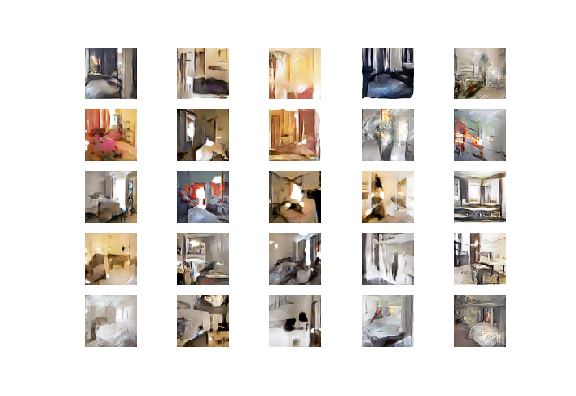

# SelfGAN--Not A GAN But Punch Itself



<p align="center">
  
  <center><i>Fig1. Model training process</i></center>
</p>

This repository contains the official implementation of the following casual paper:

[SelfGAN](https://vixra.org/abs/1902.0445)

Additional pretrained models and training results can be found in Google Drive folder:

[SelfGAN Folder](https://drive.google.com/open?id=1rLUk76rUm7pO5Zm4EtxllKR3stv0wfxh)

## Remind

The parts of the source code about Self Pix2Pix and Self CycleGAN have not been fully tested, and I have no energy to work hard in this area for the time being.

## Acknowledgements

Thanks to Colab for free resources.

## Citation
```
@article{hecongwu2019selfgan,
  title={SelfGAN--Not A GAN But Punch Itself},
  author={Hecong Wu},
  journal={viXra preprint viXra:1902.0445},
  year={2019}
}
```
## Written in the last

If you think this is a good project, buy me a coffee: HighCWu@163.com .

## Licenses

MIT License.