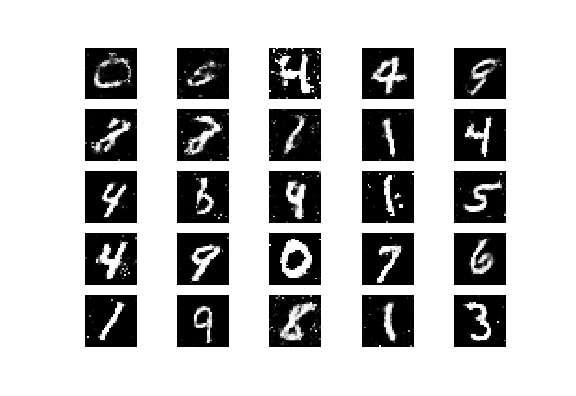
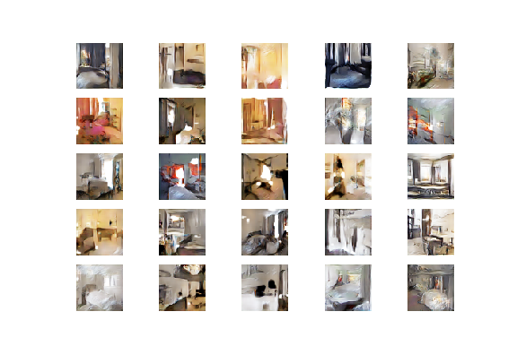

# SelfGAN--Not A GAN But Punch Itself

## Author

Hecong Wu (hecongw@gmail.com)


## Abstract

In my research, I modified the basic structure of GAN, let G and D train together, and use dynamic loss weights to achieve a relatively balanced training.

**Keywords**: Dynamic balance, dynamic loss weights


## 1  Introduction

One problem with the classic GAN is that it is difficult to control the strength of the generator and discriminator. I broke the structure of the traditional GAN, let the generator and the discriminator connect together, and let it punches itself during the training so that the discriminator and the generator can adapt to each other.

I tested the model on the mnist dataset and the 20% LSUN Bedroom dataset, and achieved satisfactory results. The model is trained by Pytorch on the GPU and Tensorflow Keras on the TPU using different parameters due to some difference between GPU and TPU.


## 2  Related work

My work is based entirely on GAN related papers.


## 3  Overview

<p align="center">
  
  <center><i>Fig1. Model training process</i></center>
</p>

I trained the generator and the discriminator in the same gradient descent process.

In this process, the greater the loss of the discriminator, the greater the weight it occupies in the sum of the discriminator losses. This will make the changes in several losses very unstable, but actually achieve a dynamic balance effect.

## 4  Evaluation

I am poor in studying deep learning. Despite the scarce resources, I am very grateful to Colab for giving me free GPUs and TPUs for training models.

On PyTorch GPU, I compute final loss like this: 
```python
v_g = mean(gen_loss) # (batch_size,) => ()
v_f = mean(fake_loss) # (batch_size,) => ()
self_loss = (real_loss + 0.1 * v_g * gen_loss + 0.9 * v_f * fake_loss) / 2
```

On Keras TPU, I compute final loss like this:
```python
v_g = mean(gen_loss) # (batch_size,) => ()
v_r = mean(real_loss) # (batch_size,) => ()
v_f = mean(fake_loss) # (batch_size,) => ()
v_sum = v_g + v_r + v_f
self_loss = real_loss*v_r/v_sum + gen_loss*v_g/v_sum + fake_loss*v_f/v_sum
```

Why are the parameters different? In the PyTorch GPU I use a smaller generator ratio to prevent the discriminator from always discriminating the picture as true. But this method is not good on the Keras TPU, because the Keras TPU will cut the input into eight equal parts, which will cause a difference in the batch. I use the loss all to participate in the dynamic weight allocation method to solve this problem.

What I need to explain is, TPU does not seem to have ResizeNearestNeighbor operation, so I used Upscale of StyleGAN<a href="#5">[5]</a> to replace Keras' default UpSampling2D layer.

Here are some training results: 

<figure class="third">
  <p align="center">
  
  
  
  </p>
  <center><i>SelfGAN GPU MNIST step.2000,20000,59600 64x1x28x28(BCHW)</i></center>
</figure>

<figure class="second">
  <p align="center">
  
  
  </p>
  <center><i>Self DCGAN GPU MNIST step.2000,20000 64x1x32x32(BCHW)</i></center>
</figure>

<figure class="third">
  <p align="center">
  
  
  
  </p>
  <center><i>SelfGAN TPU MNIST step.2000,20000,68800 64x28x28x1(BHWC)</i></center>
</figure>

<figure class="third">
  <p align="center">
  
  
  
  </p>
  <center><i>Self DCGAN TPU MNIST step.2000,20000,68000 64x28x28x1(BHWC)</i></center>
</figure>


<figure class="third">
  <p align="center">
  
  
  
  </p>
  <center><i>SelfGAN TPU Bedroom step.2000,20000,68800 64x64x64x3(BHWC)</i></center>
</figure>

Except the earliest GAN<a href="#1">[1]</a> and DCGAN<a href="#2">[2]</a>, I also tried to convert Pix2Pix<a href="#3">[3]</a> and CycleGAN<a href="#4">[4]</a> into the form of SelfGAN, but Colab's resources don't seem to be enough for fast training of these types of models. So I hope that people with more resources can try it. I may now have no time to try.

## 8  Conclusion

It seems that my SelfGAN can achieve the same effect as the general GAN. I don't have time to compare. But I think that introducing dynamic balance should speed up the training of the model and avoid some shortcomings. It looks very similar to GAN, but it is brand new. It should have more potential to be tapped.

I will open source after this casual article is published. I hope my ideas can be approved.

## References

<a name="1">[1]</a>  Goodfellow IJ, Pouget-Abadie J, Mirza M, Xu B, Warde-Farley D, Ozair S, Courville A, Bengio Y. Generative Adversarial Networks. arXiv e-prints. arXiv preprint arXiv:1406.2661. 2014 Jun.

<a name="2">[2]</a>  Radford A, Metz L, Chintala S. Unsupervised representation learning with deep convolutional generative adversarial networks. arXiv preprint arXiv:1511.06434. 2015 Nov 19.

<a name="3">[3]</a>  Isola P, Zhu JY, Zhou T, Efros AA. Image-to-image translation with conditional adversarial networks. InProceedings of the IEEE conference on computer vision and pattern recognition 2017 (pp. 1125-1134).

<a name="4">[4]</a>  Zhu JY, Park T, Isola P, Efros AA. Unpaired image-to-image translation using cycle-consistent adversarial networks. InProceedings of the IEEE International Conference on Computer Vision 2017 (pp. 2223-2232).

<a name="5">[5]</a>  Karras T, Laine S, Aila T. A style-based generator architecture for generative adversarial networks. arXiv preprint arXiv:1812.04948. 2018 Dec 12.